# PARCIAL DE AREP 2

## Project Description

Los algoritmos de búsqueda son esenciales para el desarrollo de las ciencias de la computación. Este proyecto proporciona una solución web que explora dos algoritmos de búsqueda: la búsqueda lineal y la búsqueda binaria, desplegados en la infraestructura cloud de AWS EC2 utilizando tecnologías como Maven, Git, GitHub, Sparkjava, HTML5 y JavaScript.


## Getting Started

Estas instrucciones te permitirán obtener una copia del proyecto funcionando en tu máquina local para propósitos de desarrollo y pruebas. Revisa la sección de despliegue para una guía de cómo desplegar el proyecto en un sistema vivo.


### Prerequisites

Antes de comenzar, necesitarás instalar el siguiente software:

- Git
- Maven
- Spark
- Cuenta AWS con acceso a EC2
- Java
- JDK 8 o superior

## Arquitectura de Microservicios para Búsqueda

### Descripción General de la Arquitectura

La arquitectura de la aplicación se basa en un modelo de microservicios distribuidos con un balanceador de carga implementado a través de un proxy de servicio. Aquí se describe cómo cada componente interactúa dentro del sistema:

### Componentes

- **Navegador (Browser)**: La interfaz de usuario donde el usuario interactúa con la aplicación web. A través del navegador, los usuarios pueden enviar solicitudes de búsqueda lineal y binaria.

- **Service Proxy**: Un servidor intermediario desplegado en una instancia EC2 de AWS. Actúa como un balanceador de carga, recibiendo solicitudes del navegador y distribuyéndolas entre múltiples instancias de servicios de matemáticas utilizando el algoritmo de round-robin.

- **Math Services**: Estos microservicios están especializados en realizar operaciones de búsqueda lineal y binaria. Están desplegados en dos instancias EC2 separadas para asegurar la escalabilidad y la disponibilidad.

- **EC2 (Amazon Elastic Compute Cloud)**: Un servicio de Amazon Web Services (AWS) que proporciona capacidad computacional escalable en la nube. Tanto el proxy de servicios como los servicios de matemáticas se ejecutan en instancias EC2, lo que permite una gestión flexible de los recursos.

### Flujo de Trabajo

1. El usuario realiza una petición de búsqueda desde el navegador.
2. El proxy de servicio recibe la solicitud y la redirige a una de las instancias de los servicios de matemáticas siguiendo el patrón round-robin.
3. La instancia de servicio seleccionada procesa la solicitud y devuelve el resultado al proxy.
4. El proxy de servicio, a su vez, envía la respuesta de vuelta al navegador del usuario.

Esta estructura no solo mejora la robustez y el rendimiento del sistema, sino que también oculta la complejidad y la implementación interna de los servicios del lado del cliente.

## Diagrama de Arquitectura

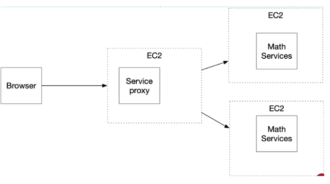


## Escalabilidad y Alta Disponibilidad

Gracias al uso de AWS EC2 y la arquitectura de microservicios, el sistema puede escalar horizontalmente añadiendo más instancias según la demanda. Además, el balanceo de carga asegura que ninguna instancia esté sobrecargada, proporcionando así una alta disponibilidad y una mejor experiencia de usuario.

Para más detalles sobre cómo cada componente está configurado y desplegado, por favor revisa las secciones de instalación y despliegue a continuación.


# Installing local

Una serie de pasos para ejecutar el entorno de desarrollo:

1. Clonar el repositorio:

   git clone https://github.com/YhonatanGoomez/AREP-Parcial_2.git

1. Navegar al directorio del proyecto y compilar con Maven:
 
  cd /AREP-Parcial_2
mvn compile
mvn clean install

1. Ejecutaremos los servicios en dos terminales diferente de la siguiente forma:

java -cp "target/classes;target/dependency/*" com.mycompany.parcial2.MathService

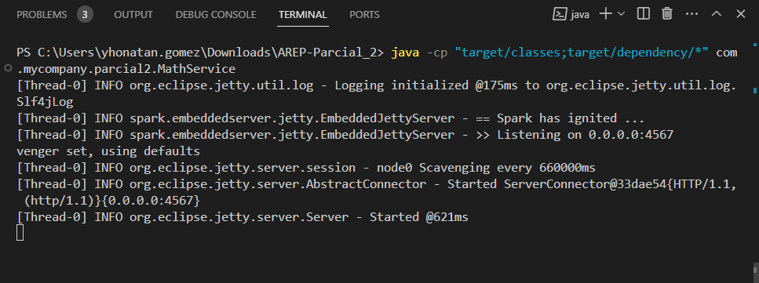

1. Siguiente servicio:

java -cp "target/classes;target/dependency/*" com.mycompany.parcial2.ProxyService http://localhost:4567 http://localhost:4567
  

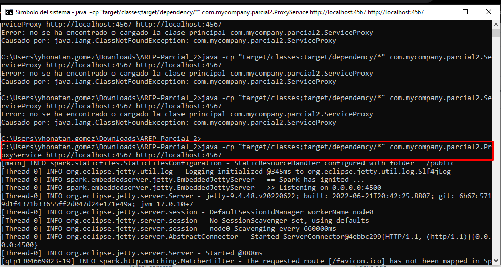

Luego de esto ya podremos ingresar mediante el browser al localhost con el siguiente link y ejecutar la aplicación

`http://localhost:4500/index.html`

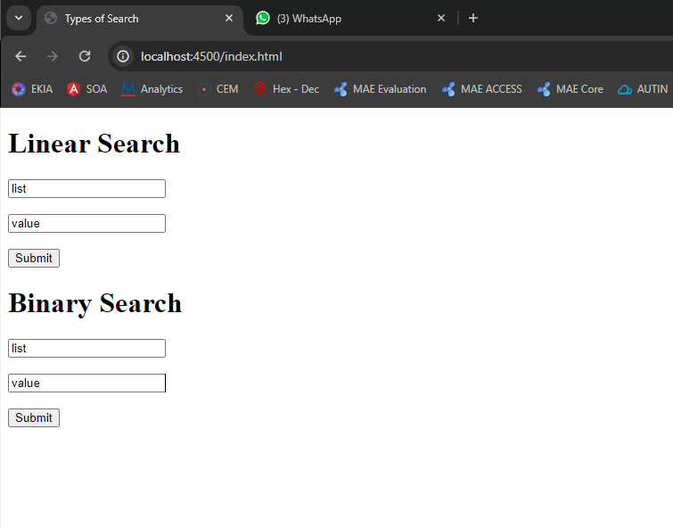

En donde comprobaremos que funcione correctamente la aplicación, primero con la:
#### Busqueda líneal
Ingresaremos un lista en el primer campo y luego de esto el valor a buscar dentro de dicha lista y lo entregaremos en el formato solicitado, retornando la posición del valor buscado
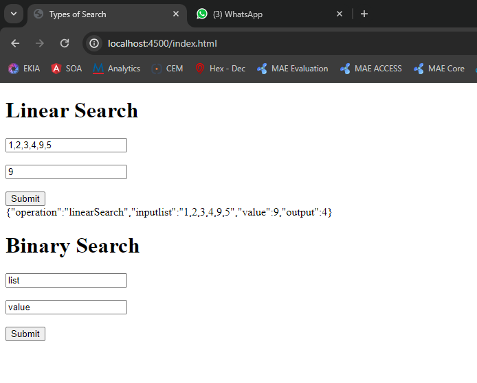

Además retornaremos el valor de "-1" cuando el elemento a buscar no se encuentre en la lista
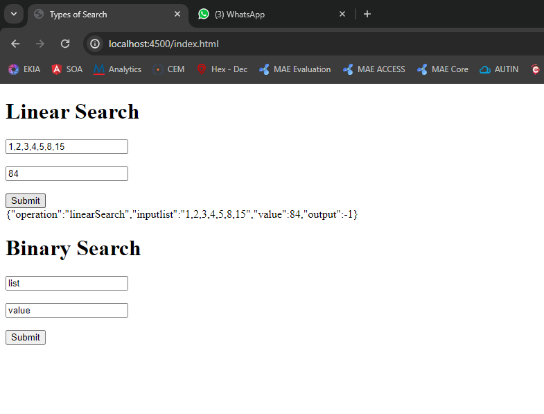

#### Busqueda binaria
Ingresaremos un lista en el primer campo y luego de esto el valor a buscar dentro de dicha lista. Para este caso, se espera que el usuario ingrese una lísta ordenada de menor a mayor y nuevamente retornará la posición del valor ingresado si lo encuentra, de lo contrario, retornará un "-1"
##### Caso exitoso
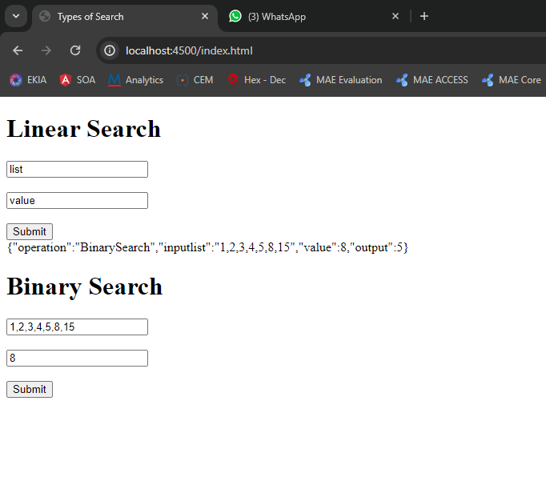
##### Valor no encontrado
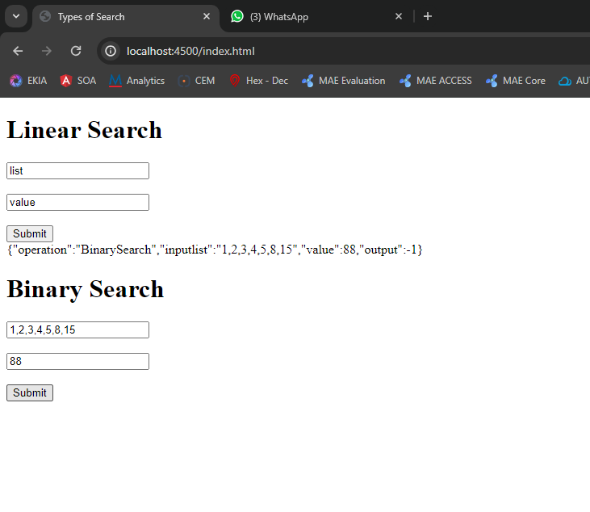

Explicaremos brevemente la lógica detras de los servicios para observar su comportamiento:

El sistema está compuesto por tres clases principales que trabajan en conjunto para proporcionar una solución web distribuida para la búsqueda lineal y binaria de elementos en una lista:

### MathService

Clase que representa el servicio de cálculo matemático. Contiene el método `main`, que inicializa el servidor Spark y define los endpoints para las operaciones de búsqueda:

- `/linear`: Implementa la búsqueda lineal. Recibe `value` y `list` como parámetros, ejecuta la búsqueda lineal en la lista de enteros proporcionada y devuelve un JSON con los resultados.
- `/binaria`: Implementa la búsqueda binaria. Funciona de manera similar al endpoint `/linear`, pero realiza una búsqueda binaria en una lista ordenada de enteros.

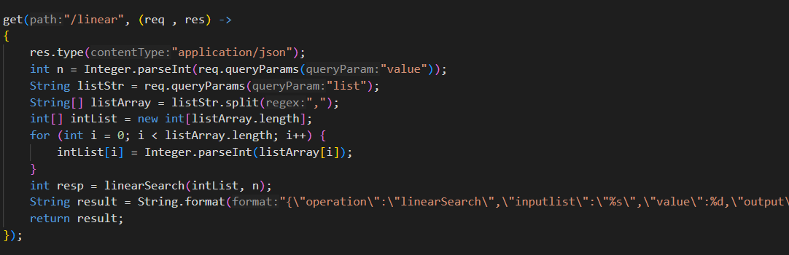
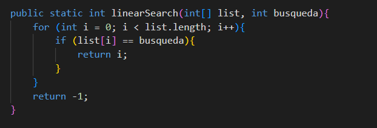

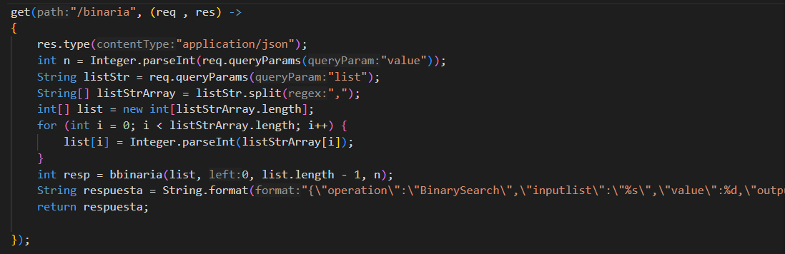
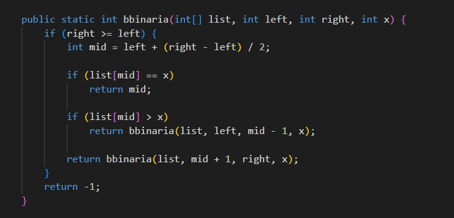

### ProxyService

Actúa como intermediario y balanceador de carga utilizando un algoritmo de Round Robin para distribuir las solicitudes entre las instancias de `MathService`. Define los mismos endpoints que `MathService` y redirige las solicitudes a las instancias del servicio.

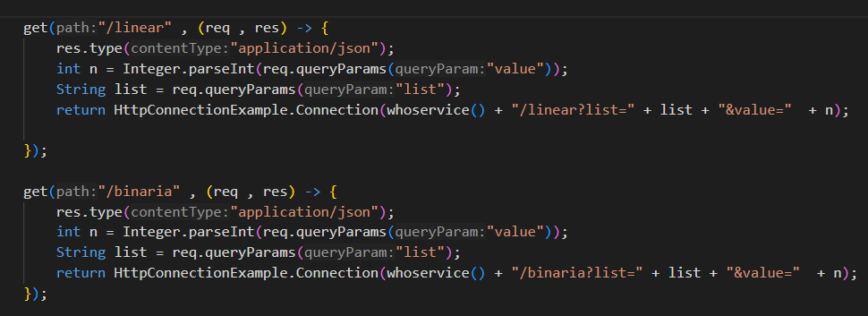

### HttpConnectionExample

Encapsula la lógica para realizar conexiones HTTP a `MathService` desde `ProxyService`, maneja la respuesta y la devuelve al cliente.

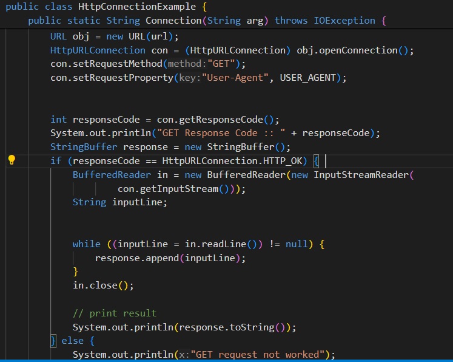

### Interfaz de Usuario

La interfaz web proporciona formularios para enviar solicitudes de búsqueda al `ProxyService`. Utiliza AJAX para realizar solicitudes asíncronas y mostrar los resultados en la misma página.
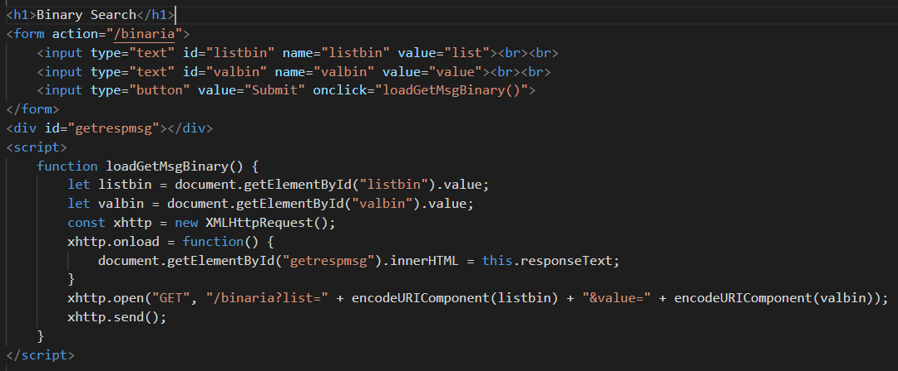


# AWS
Ahora desplegaremos todo en Amazon AWS EC2, en donde desplegaremos 3 instancias: 
- Dos para MathService
- Una para ProxyService

### Reglas de seguridad
Se establecen reglas de entrada y salida para permitir todo trafico
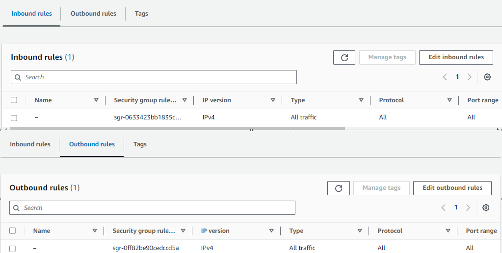

Luego de esto, se crean las instancias y se ponen a correr

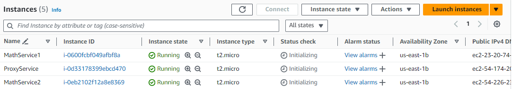

### Para todas las instancias:
Instalaremos lo siguiente en todos los Amazon Linux
- Maven
- Github
- Java


##### Instalacion de git:

```bash
sudo yum install -y git
```


##### Instalacion de java:

```bash
sudo yum install -y java-17-amazon-corretto-devel
```


##### Instalacion de Maven:

```bash
sudo yum install maven
```

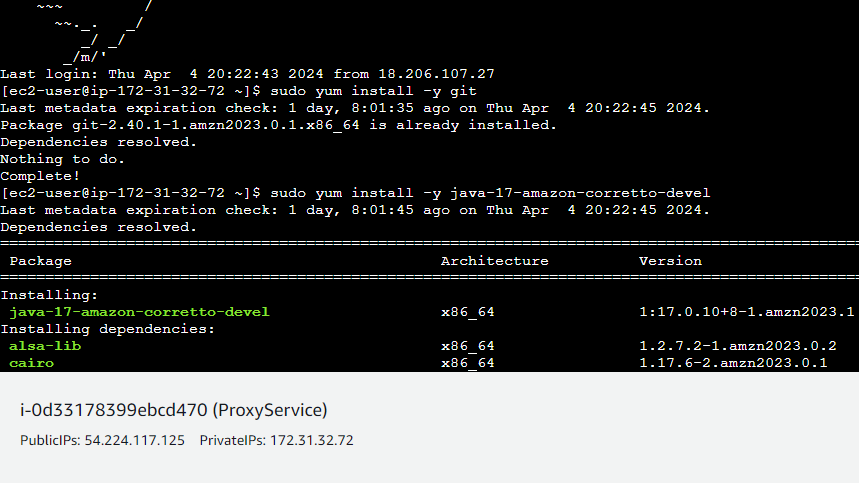

Clonamos y en el directorio ejecutamos el repositorio en todas las instancias

En donde construiremos el proyecto y lo ejecutaremos en todas las instancias de la misma manera
```bash
mvn compile
mvn clean install
```

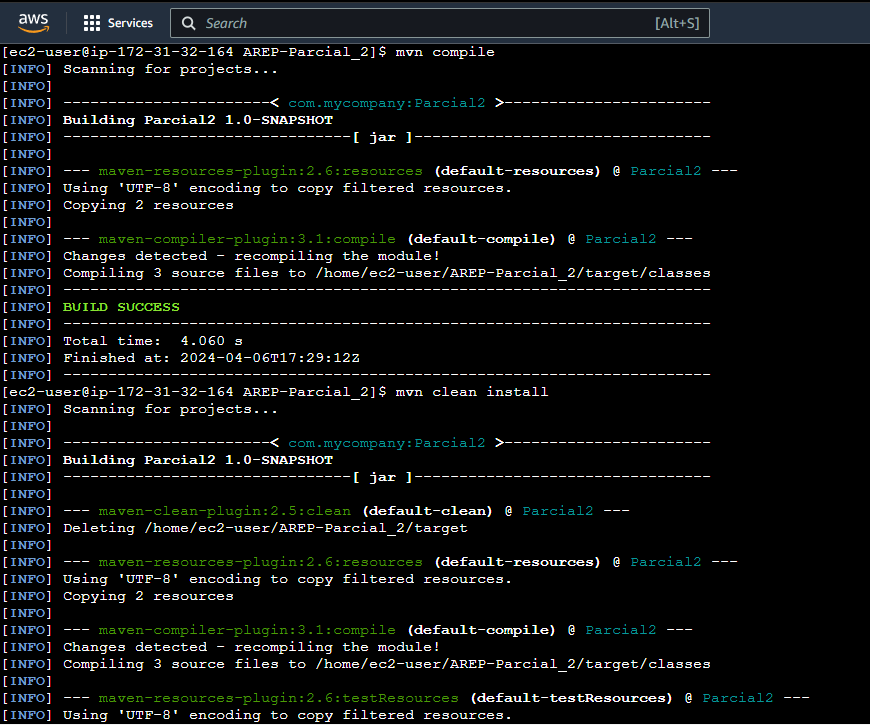

Ahora estaremos listos para ejecutar cada instancia creada, ambas MathService se ejecutaran con el siguiente comando
```bash
java -cp "target/classes;target/dependency/*" com.mycompany.parcial2.MathService
```
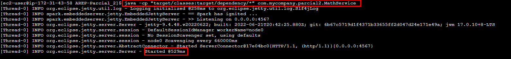

En donde vemos que la instancia queda iniciada

Y para la instacia de ProxyService ejecutaremos el siguiente comando
```bash
java -cp "target/classes;target/dependency/*" com.mycompany.parcial2.ProxyService http://ec2-54-161-68-145.compute-1.amazonaws.com:4567 http://ec2-54-161-124-105.compute-1.amazonaws.com:4567
```

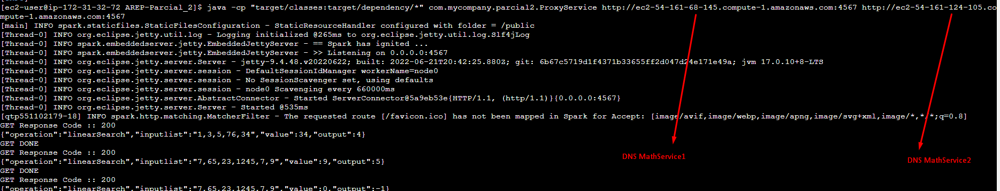
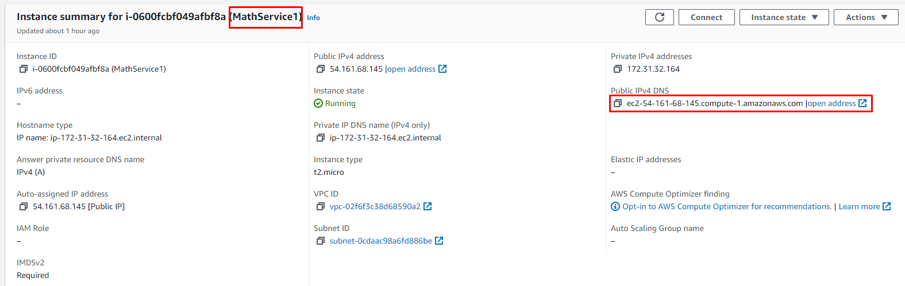
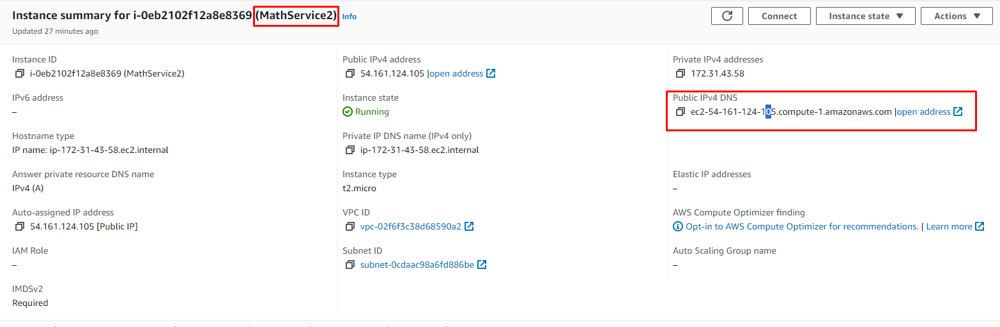

Para asi poder que el Proxy distribuya las cargas a ambos MathService.


Ahora procedemos en el browser mediante la direccion IPV4 del DNS del ProxyService y el puerto especificado accederemos a la interfaz de usuario definida
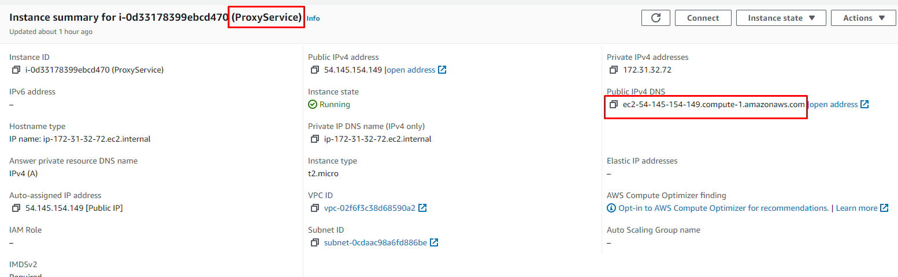
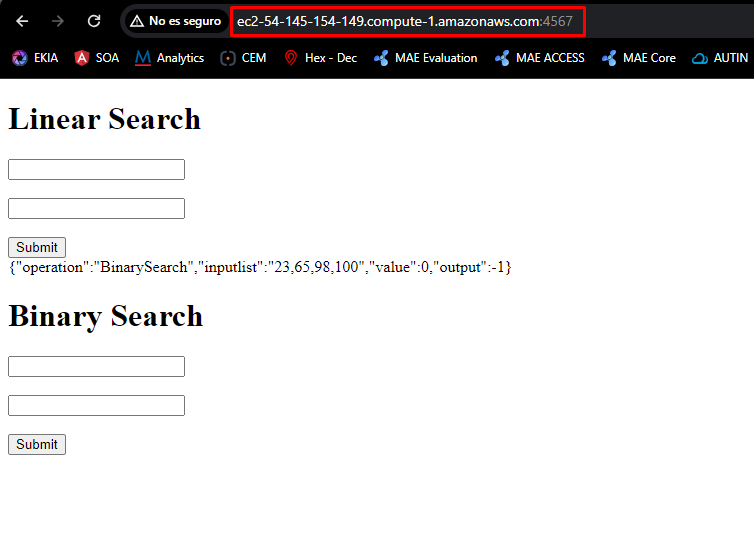

En el video podremos ver mas a detalle el funcionamiento `Seccion: Pruebas y Despliegue en AWS`
 
## Built With
- **Java** - Lenguaje con el cual funciona la mayor parte del proyecto
- **Html** - Usado para la sección del cliente
- **JavaScript** - Este lenguaje le permite al cliente realizar las peticiones necesarias
- **Maven** - Usado para la construcción de la estructura del proyecto
- **Git** - Usado para el versionamiento
- **Docker** - Es un software que permite crear imágenes y correr contenedores
- **Spark** - Framework con el cual se realizó el API
- **AWS** - Plataforma de servicios en la nube que maneja almacenamiento, bases de datos, análisis, inteligencia artificial, aprendizaje automático, Internet de las cosas (IoT), seguridad y mucho más.


## Authors

**Yhonatan Steven Gómez Jiménez**


## Pruebas y Despliegue en AWS

https://youtu.be/5p3uJBGYK3c
